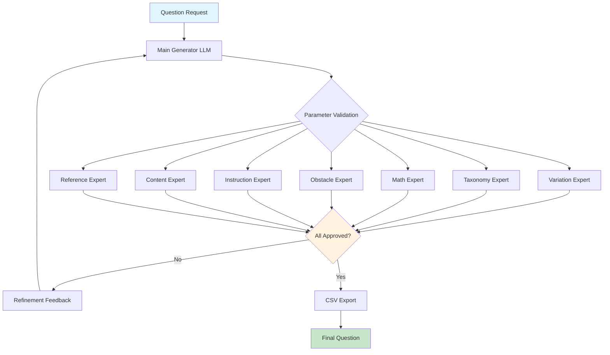

# Educational AI - Parameter-Expert LLM System


An educational AI system that uses parameter-specific expert LLMs running on Ollama servers to generate and validate educational questions. The system features specialized experts for different aspects of question design, running in a memory-optimized architecture for AMD GPUs.

- **Parameter-Specific Experts**: 7+ specialized LLMs, each mastering specific aspects of educational question design
- **Memory-Optimized Architecture**: Intelligent model swapping system for 20GB VRAM efficiency  
- **Modular Structure**: Clean separation of agent, callers, and development files
- **Result Management**: Timestamped result folders with prompt snapshots and CSV exports

## System Architecture



### Expert LLM Specialists

| Expert | Focus Parameters | Model | Expertise |
|--------|------------------|-------|-----------|
| **Variation Expert** | `p.variation` | llama3.1:8b | Difficulty level assessment (leicht/stammaufgabe/schwer) |
| **Taxonomy Expert** | `p.taxonomy_level` | mistral:7b | Bloom's taxonomy classification (Stufe 1/2) |
| **Math Expert** | `p.mathematical_requirement_level` | qwen2.5:7b | Mathematical complexity analysis (0-2 scale) |
| **Obstacle Expert** | `p.*_obstacle_*` | llama3.2:3b | Linguistic barriers (passive, negation, complex NP) |
| **Instruction Expert** | `p.instruction_*` | mistral:7b | Clarity and explicitness analysis |
| **Content Expert** | `p.root_text_contains_irrelevant_information` | llama3.1:8b | Content relevance validation |
| **Reference Expert** | `p.root_text_reference_explanatory_text` | llama3.2:3b | Text reference analysis |

## Quick Start

### Prerequisites

- **Hardware**: AMD GPU with 20GB VRAM (RX 6000/7000 series recommended)
- **OS**: Manjaro Linux (Arch-based)
- **Python**: 3.8+
- **ROCm**: 6.2+ compatible

### Installation

1. **Clone the Repository**
   ```bash
   git clone <repository-url>
   cd educational-ai-system
   ```

2. **Install ROCm and Dependencies**
   ```bash
   chmod +x setup_rocm_ManjArch_AMD7kSeries.sh
   ./setup_rocm_ManjArch_AMD7kSeries.sh
   
   # Reboot required for ROCm
   sudo reboot
   ```

3. **Verify Installation**
   ```bash
   # Check GPU detection
   rocm-smi
   
   # Optimize GPU for compute workloads
   ./optimize_gpu.sh
   
   # Validate complete setup
   ./validate_setup.sh
   ```

4. **Download AI Models**
   ```bash
   # Download optimized models for 20GB VRAM
   ./download_models.sh
   ```

5. **Start the System**
   ```bash
   # Start Ollama servers first
   ./start_ollama_servers.sh
   
   # Then start the main orchestrator
   python3 ALEE_Agent/educational_ai_orchestrator.py
   ```

6. **Verify System Health**
   ```bash
   # Run comprehensive tests
   python3 CallersWithTexts/test_system.py
   
   # Access API documentation
   # http://localhost:8000/docs
   ```

## Technical Specifications

### Memory Management

```python
MEMORY_CONFIGURATION = {
    "total_vram": "20GB",
    "max_concurrent_models": 2,
    "memory_buffer": "2GB",
    "model_swapping": "dynamic",
    "vram_monitoring": "real-time"
}

MODEL_MEMORY_USAGE = {
    "llama3.1:8b": "5.5GB (Q4_K_M)",
    "mistral:7b": "5.0GB (Q4_K_M)", 
    "qwen2.5:7b": "5.0GB (Q4_K_M)",
    "llama3.2:3b": "2.5GB (Q4_K_M)"
}
```

### Performance Metrics

| Metric | Value | Notes |
|--------|-------|-------|
| **Concurrent Models** | Max 2 | Memory-optimized via semaphore |
| **VRAM Efficiency** | ~55% utilization | 11GB usage, 9GB for operations |
| **Processing Speed** | 15-25 tokens/sec | Per active model |
| **Parameter Validation** | 7+ experts | Specialized domain knowledge |
| **Iteration Limit** | 5 cycles | Self-perfecting feedback loop |

## API Reference

### Core Endpoints

#### Generate Question
```http
POST /generate-question
Content-Type: application/json

{
  "topic": "Bedürfnisse und Güter",
  "difficulty": "leicht",
  "age_group": "9. Klasse",
  "context": "Wirtschaftliche Grundbegriffe"
}
```

**Response:**
```json
{
  "question_content": {
    "aufgabenstellung": "...",
    "antwortoptionen": ["A", "B", "C", "D"],
    "korrekte_antwort": "A"
  },
  "parameter_validations": [
    {
      "parameter": "p.variation",
      "status": "approved",
      "score": 8.5,
      "expert_used": "variation_expert"
    }
  ],
  "iterations": 2,
  "total_processing_time": 12.3,
  "final_status": "approved",
  "csv_ready": {...}
}
```

#### Batch Generation
```http
POST /batch-generate
Content-Type: application/json

[
  {"topic": "Angebot und Nachfrage", "difficulty": "leicht"},
  {"topic": "Marktformen", "difficulty": "stammaufgabe"},
  {"topic": "Wirtschaftspolitik", "difficulty": "schwer"}
]
```

#### System Monitoring
```http
GET /health
GET /models/status
```

### Python SDK Example

```python
import asyncio
import aiohttp

class EducationalAIClient:
    def __init__(self, base_url="http://localhost:8000"):
        self.base_url = base_url
    
    async def generate_question(self, topic, difficulty, age_group="9. Klasse"):
        async with aiohttp.ClientSession() as session:
            request = {
                "topic": topic,
                "difficulty": difficulty,
                "age_group": age_group
            }
            
            async with session.post(
                f"{self.base_url}/generate-question", 
                json=request
            ) as response:
                return await response.json()
    
    async def get_system_status(self):
        async with aiohttp.ClientSession() as session:
            async with session.get(f"{self.base_url}/health") as response:
                health = await response.json()
            
            async with session.get(f"{self.base_url}/models/status") as response:
                models = await response.json()
                
            return {"health": health, "models": models}

# Usage
async def main():
    client = EducationalAIClient()
    
    # Generate a question
    result = await client.generate_question(
        topic="Opportunitätskosten",
        difficulty="schwer"
    )
    
    print(f"Question generated in {result['total_processing_time']:.2f}s")
    print(f"Iterations: {result['iterations']}")
    print(f"Final status: {result['final_status']}")
    
    # Check system status
    status = await client.get_system_status()
    print(f"VRAM usage: {status['models']['vram_usage_gb']:.1f}GB")

# Run
asyncio.run(main())
```

## Project Structure

```
/
├── _dev/                                   # Development files
│   ├── README_DEPLOYMENT.md               # System documentation
│   ├── _old/                              # Legacy files
│   └── providedProjectFromStakeHolder/    # Stakeholder data
├── ALEE_Agent/                            # Main AI system
│   ├── educational_ai_orchestrator.py     # FastAPI server
│   └── prompts/                           # Expert prompts
├── CallersWithTexts/                      # Testing & results
│   ├── test_system.py                     # System tests
│   ├── result_manager.py                  # Result organization
│   ├── task_metadata_with_answers_final2_colcleaned.csv  # CSV data
│   └── results/                           # Timestamped outputs
│       └── YYYY-MM-DD_HH-MM-SS/          # Session folders
│           ├── prompts/                   # Used prompts
│           └── results/                   # Generated CSV
└── *.sh                                   # Setup scripts
```

## Parameter Validation System

### Supported Parameters

The system validates all educational question parameters according to German educational standards:

#### Core Parameters
- `p.variation` - Difficulty level (leicht, stammaufgabe, schwer)
- `p.taxonomy_level` - Cognitive level (Stufe 1: Wissen, Stufe 2: Anwendung)
- `p.mathematical_requirement_level` - Math complexity (0-2 scale)

#### Text Analysis Parameters
- `p.root_text_reference_explanatory_text` - Reference text usage
- `p.root_text_contains_irrelevant_information` - Content relevance
- `p.instruction_explicitness_of_instruction` - Instruction clarity

#### Linguistic Obstacle Parameters
- `p.root_text_obstacle_passive` - Passive voice constructions
- `p.root_text_obstacle_negation` - Negation usage
- `p.root_text_obstacle_complex_np` - Complex noun phrases
- `p.item_X_obstacle_*` - Answer choice obstacles
- `p.instruction_obstacle_*` - Instruction obstacles

### Validation Process

1. **Parameter Extraction**: Identify relevant parameters from question request
2. **Expert Assignment**: Route parameters to specialized expert LLMs
3. **Concurrent Validation**: Run parameter checks asynchronously (max 2 models)
4. **Feedback Integration**: Collect expert recommendations
5. **Iterative Refinement**: Improve question based on expert feedback
6. **Approval Gate**: Ensure all parameters meet quality standards

## Expert LLM Prompts

### Variation Expert
Specializes in difficulty assessment using cognitive load theory and educational psychology principles.

**Key Evaluation Criteria:**
- Cognitive demand analysis
- Complexity level assessment  
- Context familiarity evaluation
- Distractor quality analysis

### Taxonomy Expert  
Focuses on Bloom's taxonomy classification and learning objective alignment.

**Key Evaluation Criteria:**
- Cognitive operation identification
- Transfer requirement analysis
- Situational novelty assessment
- Multi-step thinking evaluation

### Math Expert
Analyzes mathematical complexity and quantitative requirements.

**Key Evaluation Criteria:**
- Calculation difficulty assessment
- Mathematical representation usage
- Age-appropriate complexity
- Economic integration quality

### Obstacle Expert
Evaluates linguistic barriers and text accessibility.

**Key Evaluation Criteria:**
- Passive voice detection
- Negation complexity analysis
- Noun phrase structure evaluation
- Cumulative cognitive load assessment

## Configuration

### Model Configuration
```python
# ALEE_Agent/educational_ai_orchestrator.py
PARAMETER_EXPERTS = {
    "variation_expert": ParameterExpertConfig(
        name="variation_expert",
        model="llama3.1:8b",
        port=8001,
        parameters=["p.variation"],
        expertise="Difficulty level assessment",
        temperature=0.2
    ),
    # ... additional experts
}
```

### Memory Management
```python
class ModelManager:
    def __init__(self):
        self.model_memory_usage = {
            "llama3.1:8b": 5.5,    # GB
            "mistral:7b": 5.0,
            "qwen2.5:7b": 5.0,
            "llama3.2:3b": 2.5
        }
        self.max_vram_gb = 18  # Leave 2GB buffer
```

### Environment Variables
```bash
# ROCm Configuration
export ROCM_PATH=/opt/rocm
export HSA_OVERRIDE_GFX_VERSION=11.0.0  # RX 7000 series
export HIP_VISIBLE_DEVICES=0

# Ollama Optimization
export OLLAMA_NUM_PARALLEL=2
export OLLAMA_MAX_LOADED_MODELS=2
export OLLAMA_FLASH_ATTENTION=1
```

## Testing

### Comprehensive Test Suite

The system includes extensive testing capabilities:

```bash
# Run all tests
python3 CallersWithTexts/test_system.py

# Individual test components (if pytest setup exists)
python3 -m pytest tests/ -v
```

### Test Coverage

- **Health Checks**: System connectivity and service availability
- **Model Loading**: GPU detection and model initialization
- **Parameter Validation**: Expert LLM functionality across all parameters
- **Memory Management**: VRAM efficiency under load
- **Batch Processing**: Multi-question generation performance
- **API Endpoints**: Complete REST API functionality

### Performance Benchmarks

```python
# Example test results
TEST_RESULTS = {
    "single_question_generation": "8-15 seconds",
    "batch_generation_3_questions": "25-35 seconds", 
    "memory_efficiency": "10-11GB VRAM usage",
    "parameter_coverage": "7+ experts validated",
    "api_response_time": "<200ms (health checks)"
}
```

## Monitoring and Observability

### System Monitoring
```bash
# GPU monitoring
watch -n 1 rocm-smi

# System resources
btop

# Application logs
tail -f logs/educational_ai.log
```

### Performance Metrics
- **VRAM Usage**: Real-time memory monitoring via `/models/status`
- **Model Swapping**: Dynamic loading statistics
- **Response Times**: Per-endpoint performance tracking
- **Expert Utilization**: Parameter validation coverage
- **Error Rates**: Failed validation tracking

### Health Checks
```python
# Automated health monitoring
async def health_check():
    return {
        "status": "healthy",
        "active_models": len(active_models),
        "vram_usage_gb": current_vram_usage(),
        "available_experts": list(PARAMETER_EXPERTS.keys()),
        "timestamp": datetime.now().isoformat()
    }
```

## Production Deployment

### Docker Deployment
```dockerfile
FROM rocm/pytorch:latest

# Install dependencies
RUN pip install fastapi uvicorn aiohttp pydantic ollama-python

# Copy application
WORKDIR /app
COPY . .

# Expose API port
EXPOSE 8000

# Start with ROCm support
CMD ["uvicorn", "educational_ai_orchestrator:app", "--host", "0.0.0.0", "--port", "8000"]
```

```bash
# Build and run
docker build -t educational-ai .
docker run --device=/dev/kfd --device=/dev/dri \
  --group-add video -p 8000:8000 \
  -v $(pwd)/models:/app/models \
  educational-ai
```

### Systemd Service
```ini
# /etc/systemd/system/educational-ai.service
[Unit]
Description=Educational AI Parameter-Expert System
After=network-online.target

[Service]
Type=simple
User=ai-service
Group=ai-service
WorkingDirectory=/opt/educational-ai
ExecStart=/usr/bin/python3 start_system.py
Restart=always
RestartSec=3
Environment="ROCM_PATH=/opt/rocm"

[Install]
WantedBy=multi-user.target
```

### Load Balancing
For high-throughput scenarios, deploy multiple instances:

```yaml
# docker-compose.yml
version: '3.8'
services:
  educational-ai-1:
    build: .
    ports:
      - "8001:8000"
    devices:
      - "/dev/kfd:/dev/kfd"
      - "/dev/dri:/dev/dri"
    
  educational-ai-2:
    build: .
    ports:
      - "8002:8000"
    devices:
      - "/dev/kfd:/dev/kfd" 
      - "/dev/dri:/dev/dri"
  
  nginx:
    image: nginx:alpine
    ports:
      - "80:80"
    volumes:
      - ./nginx.conf:/etc/nginx/nginx.conf
```

## Security Considerations

### API Security
- **Rate Limiting**: Implement request throttling for production use
- **Authentication**: Add JWT or API key authentication
- **Input Validation**: Comprehensive request validation
- **CORS Configuration**: Properly configure cross-origin requests

### Model Security
- **Model Isolation**: Each expert runs in controlled environment
- **Input Sanitization**: Clean prompts before LLM processing
- **Output Filtering**: Validate generated content
- **Resource Limits**: Prevent resource exhaustion attacks

## Troubleshooting

### Common Issues

#### ROCm Not Detected
```bash
# Check GPU architecture
lspci | grep VGA

# Set correct GFX version
export HSA_OVERRIDE_GFX_VERSION=11.0.0  # RX 7000
export HSA_OVERRIDE_GFX_VERSION=10.3.0  # RX 6000
```

#### Models Not Loading
```bash
# Check Ollama service
sudo systemctl status ollama

# Verify model downloads
ollama list

# Test model manually
ollama run llama3.1:8b "Hello"
```

#### VRAM Overflow
```bash
# Monitor memory usage
watch -n 1 'rocm-smi && echo "---" && curl -s http://localhost:8000/models/status'

# Reduce concurrent models
# Edit ALEE_Agent/educational_ai_orchestrator.py: model_semaphore = asyncio.Semaphore(1)
```

#### Slow Response Times
- Verify GPU compute mode: `./optimize_gpu.sh`
- Check model quantization: Ensure Q4_K_M variants
- Monitor system resources: `btop`
- Review network connectivity to Ollama

### Debug Mode
```bash
# Run with verbose logging
export PYTHONPATH=.
python3 -m uvicorn ALEE_Agent.educational_ai_orchestrator:app --log-level debug

# Enable detailed ROCm logging
export ROCM_DEBUG=1
export HIP_DEBUG=1
```

## Additional Resources

### Documentation
- **API Reference**: `/docs` endpoint when running
- **Expert Prompts**: `ALEE_Agent/prompts/` directory for customization
- **Test Reports**: Generated in `CallersWithTexts/results/` with timestamps
- **System Info**: `CLAUDE.md` contains system memory for AI assistant

### Model Information
- **Ollama Models**: [https://ollama.com/library](https://ollama.com/library)
- **ROCm Documentation**: [https://rocm.docs.amd.com/](https://rocm.docs.amd.com/)
- **FastAPI Documentation**: [https://fastapi.tiangolo.com/](https://fastapi.tiangolo.com/)

### Community
- **Issues**: Report bugs and feature requests via GitHub Issues
- **Discussions**: Technical discussions and Q&A
- **Contributing**: See `CONTRIBUTING.md` for development guidelines

## License

This project is licensed under the MIT License - see the [LICENSE](LICENSE) file for details.

## Acknowledgments

- **AMD ROCm Team** - For excellent GPU compute support
- **Ollama Project** - For simplified local LLM deployment  
- **Hugging Face** - For transformer models and tokenizers
- **FastAPI** - For high-performance async API framework
- **Educational Research Community** - For parameter frameworks and validation methods

---

** The Educational AI Parameter-Expert System represents the next evolution in AI-powered educational content generation, combining specialized domain expertise with efficient resource utilization for unprecedented quality in question generation.**