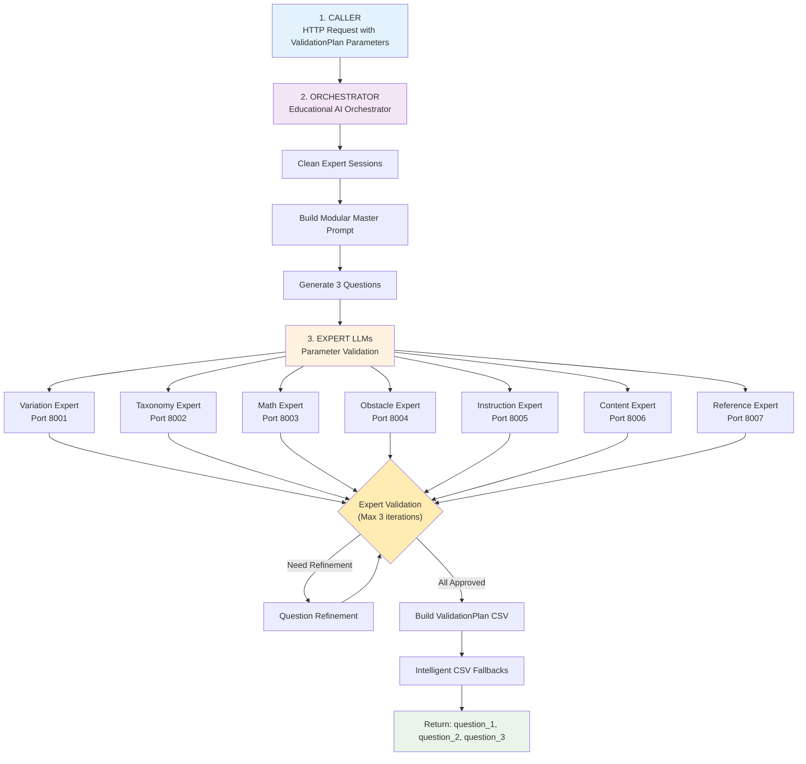
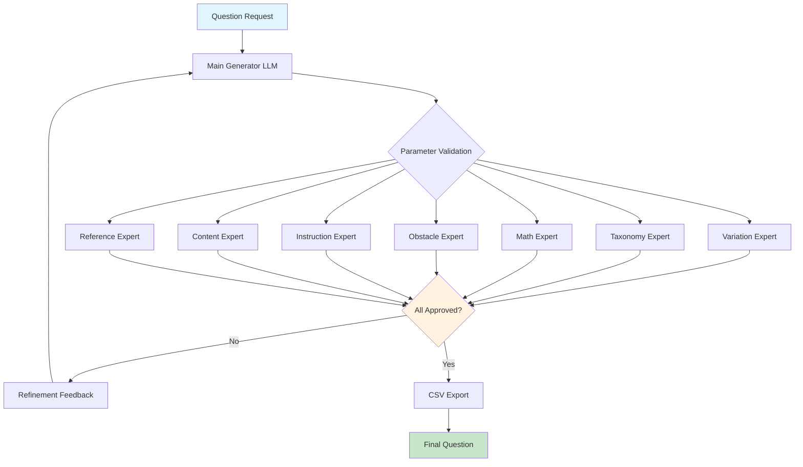

# Educational AI - ValidationPlan-Aligned Parameter-Expert LLM System


A **ValidationPlan-compliant** educational AI system that generates exactly 3 questions per request using parameter-specific expert LLMs. The system follows a three-layered architecture (Caller → Orchestrator → Experts) with modular prompt construction and intelligent CSV conversion fallbacks.

## ValidationPlan Compliance
- **Three-Layer Architecture**: Caller → Orchestrator → Expert LLMs as specified
- **Exact Parameter Implementation**: All ValidationPlan parameters (c_id, text, p.variation, etc.)
- **Modular Prompt System**: Uses parameter-specific .txt files for prompt construction
- **3-Question Generation**: Generates exactly 3 questions with expert validation
- **Complete CSV Format**: Matches ValidationPlan example with all required columns
- **Expert Session Management**: Fresh start for each request, no model reloading
- **Intelligent Fallbacks**: LM-assisted CSV correction with error handling

## ValidationPlan Three-Layer Architecture



## Legacy System Architecture



### Expert LLM Specialists

| Expert | Focus Parameters | Model | Expertise |
|--------|------------------|-------|-----------|
| **Variation Expert** | `p.variation` | llama3.1:8b | Difficulty level assessment (leicht/stammaufgabe/schwer) |
| **Taxonomy Expert** | `p.taxonomy_level` | mistral:7b | Bloom's taxonomy classification (Stufe 1/2) |
| **Math Expert** | `p.mathematical_requirement_level` | qwen2.5:7b | Mathematical complexity analysis (0-2 scale) |
| **Obstacle Expert** | `p.*_obstacle_*` | llama3.2:3b | Linguistic barriers (passive, negation, complex NP) |
| **Instruction Expert** | `p.instruction_*` | mistral:7b | Clarity and explicitness analysis |
| **Content Expert** | `p.root_text_contains_irrelevant_information` | llama3.1:8b | Content relevance validation |
| **Reference Expert** | `p.root_text_reference_explanatory_text` | llama3.2:3b | Text reference analysis |

## Quick Start

### Prerequisites

- **Hardware**: AMD GPU with 20GB VRAM (RX 6000/7000 series recommended)
- **OS**: Manjaro Linux (Arch-based)
- **Python**: 3.8+
- **ROCm**: 6.2+ compatible

### Installation

1. **Clone the Repository**
   ```bash
   git clone <repository-url>
   cd educational-ai-system
   ```

2. **Install ROCm and Dependencies**
   ```bash
   chmod +x setup_rocm_ManjArch_AMD7kSeries.sh
   ./setup_rocm_ManjArch_AMD7kSeries.sh
   
   # Reboot required for ROCm
   sudo reboot
   ```

3. **Verify Installation**
   ```bash
   # Check GPU detection
   rocm-smi
   
   # Optimize GPU for compute workloads
   ./optimize_gpu.sh
   
   # Validate complete setup
   ./validate_setup.sh
   ```

4. **Download AI Models**
   ```bash
   # Download optimized models for 20GB VRAM
   ./download_models.sh
   ```

5. **Start the System**
   ```bash
   # Start Ollama servers first
   ./start_ollama_servers.sh
   
   # Then start the main orchestrator
   python3 ALEE_Agent/educational_ai_orchestrator.py
   ```

6. **Verify System Health**
   ```bash
   # Run comprehensive tests
   python3 CallersWithTexts/test_system.py
   
   # Access API documentation
   # http://localhost:8000/docs
   ```

## Technical Specifications

### Memory Management

```python
MEMORY_CONFIGURATION = {
    "total_vram": "20GB",
    "max_concurrent_models": 2,
    "memory_buffer": "2GB",
    "model_swapping": "dynamic",
    "vram_monitoring": "real-time"
}

MODEL_MEMORY_USAGE = {
    "llama3.1NutzenMathematischerDarstellungen:8b": "5.5GB (Q4_K_M)",
    "mistral:7b": "5.0GB (Q4_K_M)", 
    "qwen2.5:7b": "5.0GB (Q4_K_M)",
    "llama3.2:3b": "2.5GB (Q4_K_M)"
}
```

### Performance Metrics

| Metric | Value | Notes |
|--------|-------|-------|
| **Concurrent Models** | Max 2 | Memory-optimized via semaphore |
| **VRAM Efficiency** | ~55% utilization | 11GB usage, 9GB for operations |
| **Processing Speed** | 15-25 tokens/sec | Per active model |
| **Parameter Validation** | 7+ experts | Specialized domain knowledge |
| **Iteration Limit** | 3 cycles | ValidationPlan-specified limit |
| **Question Output** | Exactly 3 | Per ValidationPlan requirements |
| **CSV Compliance** | 100% | All ValidationPlan columns implemented |
| **Parameter Coverage** | 16 parameters | Complete ValidationPlan implementation |

## API Reference

### Core Endpoints

#### ValidationPlan Question Generation (PRIMARY)
```http
POST /generate-validation-plan
Content-Type: application/json

{
  "c_id": "41-1-4",
  "text": "Die Inflation beschreibt einen allgemeinen Anstieg des Preisniveaus...",
  "p_variation": "stammaufgabe",
  "p_taxonomy_level": "Stufe 1 (Wissen/Reproduktion)",
  "p_mathematical_requirement_level": "0",
  "p_root_text_obstacle_passive": "Nicht Enthalten",
  "p_root_text_obstacle_negation": "Nicht Enthalten",
  "p_root_text_obstacle_complex_np": "Nicht Enthalten",
  "p_root_text_contains_irrelevant_information": "Nicht Enthalten",
  "p_item_X_obstacle_passive": "Nicht Enthalten",
  "p_item_X_obstacle_negation": "Nicht Enthalten",
  "p_item_X_obstacle_complex_np": "Nicht Enthalten",
  "p_instruction_obstacle_passive": "Nicht Enthalten",
  "p_instruction_obstacle_complex_np": "Nicht Enthalten",
  "p_instruction_explicitness_of_instruction": "Implizit"
}
```

**ValidationPlan Response:**
```json
{
  "question_1": "First generated question text...",
  "question_2": "Second generated question text...",
  "question_3": "Third generated question text...",
  "c_id": "41-1-4",
  "processing_time": 23.7,
  "csv_data": {
    "c_id": "41-1-4",
    "subject": "stammaufgabe",
    "type": "multiple-choice",
    "text": "1. Question1 2. Question2 3. Question3",
    "p.instruction_explicitness_of_instruction": "Implizit",
    "p.mathematical_requirement_level": "0 (Kein Bezug)",
    "p.taxanomy_level": "Stufe 1 (Wissen/Reproduktion)",
    "p.variation": "stammaufgabe",
    "answers": "Extracted from questions with LM assistance"
  }
}
```

#### Legacy Question Generation
```http
POST /generate-question
Content-Type: application/json

{
  "topic": "Bedürfnisse und Güter",
  "difficulty": "leicht",
  "age_group": "9. Klasse",
  "context": "Wirtschaftliche Grundbegriffe"
}
```

**Response:**
```json
{
  "question_content": {
    "aufgabenstellung": "...",
    "antwortoptionen": ["A", "B", "C", "D"],
    "korrekte_antwort": "A"
  },
  "parameter_validations": [
    {
      "parameter": "p.variation",
      "status": "approved",
      "score": 8.5,
      "expert_used": "variation_expert"
    }
  ],
  "iterations": 2,
  "total_processing_time": 12.3,
  "final_status": "approved",
  "csv_ready": {...}
}
```

#### Batch Generation
```http
POST /batch-generate
Content-Type: application/json

[
  {"topic": "Angebot und Nachfrage", "difficulty": "leicht"},
  {"topic": "Marktformen", "difficulty": "stammaufgabe"},
  {"topic": "Wirtschaftspolitik", "difficulty": "schwer"}
]
```

#### System Monitoring
```http
GET /health
GET /models/status
```

### ValidationPlan Python SDK Example

```python
import asyncio
import aiohttp

class ValidationPlanClient:
    def __init__(self, base_url="http://localhost:8000"):
        self.base_url = base_url
    
    async def generate_validation_plan_questions(self, c_id, text, p_variation, 
                                               p_taxonomy_level, **kwargs):
        """Generate 3 questions according to ValidationPlan specifications"""
        async with aiohttp.ClientSession() as session:
            request = {
                "c_id": c_id,
                "text": text,
                "p_variation": p_variation,
                "p_taxonomy_level": p_taxonomy_level,
                "p_mathematical_requirement_level": kwargs.get("p_mathematical_requirement_level", "0"),
                "p_root_text_reference_explanatory_text": kwargs.get("p_root_text_reference_explanatory_text", "Nicht vorhanden"),
                "p_root_text_obstacle_passive": kwargs.get("p_root_text_obstacle_passive", "Nicht Enthalten"),
                "p_root_text_obstacle_negation": kwargs.get("p_root_text_obstacle_negation", "Nicht Enthalten"),
                "p_root_text_obstacle_complex_np": kwargs.get("p_root_text_obstacle_complex_np", "Nicht Enthalten"),
                "p_root_text_contains_irrelevant_information": kwargs.get("p_root_text_contains_irrelevant_information", "Nicht Enthalten"),
                "p_item_X_obstacle_passive": kwargs.get("p_item_X_obstacle_passive", "Nicht Enthalten"),
                "p_item_X_obstacle_negation": kwargs.get("p_item_X_obstacle_negation", "Nicht Enthalten"),
                "p_item_X_obstacle_complex_np": kwargs.get("p_item_X_obstacle_complex_np", "Nicht Enthalten"),
                "p_instruction_obstacle_passive": kwargs.get("p_instruction_obstacle_passive", "Nicht Enthalten"),
                "p_instruction_obstacle_complex_np": kwargs.get("p_instruction_obstacle_complex_np", "Nicht Enthalten"),
                "p_instruction_explicitness_of_instruction": kwargs.get("p_instruction_explicitness_of_instruction", "Implizit")
            }
            
            async with session.post(
                f"{self.base_url}/generate-validation-plan", 
                json=request,
                timeout=aiohttp.ClientTimeout(total=300)
            ) as response:
                return await response.json()
    
    async def convert_to_csv(self, result, save_path=None):
        """Convert ValidationPlan result to CSV format"""
        csv_data = result.get('csv_data', {})
        
        if save_path:
            import csv
            with open(save_path, 'w', newline='', encoding='utf-8') as f:
                writer = csv.DictWriter(f, fieldnames=csv_data.keys())
                writer.writeheader()
                writer.writerow(csv_data)
        
        return csv_data
    
    async def get_system_status(self):
        async with aiohttp.ClientSession() as session:
            async with session.get(f"{self.base_url}/health") as response:
                health = await response.json()
            
            async with session.get(f"{self.base_url}/models/status") as response:
                models = await response.json()
                
            return {"health": health, "models": models}

# ValidationPlan Usage Example
async def main():
    client = ValidationPlanClient()
    
    # Generate ValidationPlan-compliant questions
    result = await client.generate_validation_plan_questions(
        c_id="42-2-3",
        text="Die Marktwirtschaft funktioniert über Angebot und Nachfrage. Preise entstehen durch das Zusammenspiel von Anbietern und Nachfragern auf dem Markt.",
        p_variation="leicht",
        p_taxonomy_level="Stufe 2 (Anwendung/Transfer)",
        p_mathematical_requirement_level="1",
        p_root_text_obstacle_passive="Enthalten"
    )
    
    print(f"Generated {len([q for q in ['question_1', 'question_2', 'question_3'] if result.get(q)])} questions")
    print(f"Processing time: {result['processing_time']:.2f}s")
    print(f"C_ID: {result['c_id']}")
    print(f"Question 1: {result['question_1'][:100]}...")
    print(f"Question 2: {result['question_2'][:100]}...")
    print(f"Question 3: {result['question_3'][:100]}...")
    
    # Convert to CSV and save
    csv_data = await client.convert_to_csv(result, "questions_output.csv")
    print(f"CSV columns: {len(csv_data)} - {list(csv_data.keys())[:5]}...")
    
    # Check system status
    status = await client.get_system_status()
    print(f"VRAM usage: {status['models']['vram_usage_gb']:.1f}GB")

# Run
asyncio.run(main())
```

## Project Structure

```
/
├── _dev/                                   # Development files
│   ├── README_DEPLOYMENT.md               # System documentation
│   ├── _old/                              # Legacy files
│   └── providedProjectFromStakeHolder/    # Stakeholder data
├── ALEE_Agent/                            # Main AI system
│   ├── educational_ai_orchestrator.py     # FastAPI server
│   └── prompts/                           # Expert prompts
├── CallersWithTexts/                      # Testing & results
│   ├── test_system.py                     # System tests
│   ├── result_manager.py                  # Result organization
│   ├── task_metadata_with_answers_final2_colcleaned.csv  # CSV data
│   └── results/                           # Timestamped outputs
│       └── YYYY-MM-DD_HH-MM-SS/          # Session folders
│           ├── prompts/                   # Used prompts
│           └── results/                   # Generated CSV
└── *.sh                                   # Setup scripts
```

## Parameter Validation System

### ValidationPlan Parameter Implementation

The system implements **ALL** parameters from ValidationPlanForClaude.md with modular prompt construction:

#### Request Parameters (As specified in ValidationPlan)
- `c_id` - Question ID format: question_number-difficulty-version (e.g., "41-1-4")
- `text` - Informational text about the system's pre-configured topic  
- `p_variation` - Difficulty: "Stammaufgabe", "schwer", "leicht"
- `p_taxonomy_level` - "Stufe 1 (Wissen/Reproduktion)", "Stufe 2 (Anwendung/Transfer)"
- `p_mathematical_requirement_level` - "0", "1", "2" with descriptions

#### Root Text Parameters
- `p_root_text_reference_explanatory_text` - "Nicht vorhanden", "Explizit", "Implizit"
- `p_root_text_obstacle_passive` - "Enthalten", "Nicht Enthalten" 
- `p_root_text_obstacle_negation` - "Enthalten", "Nicht Enthalten"
- `p_root_text_obstacle_complex_np` - "Enthalten", "Nicht Enthalten"
- `p_root_text_contains_irrelevant_information` - "Enthalten", "Nicht Enthalten"

#### Item-X Parameters
- `p_item_X_obstacle_passive` - "Enthalten", "Nicht Enthalten"
- `p_item_X_obstacle_negation` - "Enthalten", "Nicht Enthalten"
- `p_item_X_obstacle_complex_np` - "Enthalten", "Nicht Enthalten"

#### Instruction Parameters
- `p_instruction_obstacle_passive` - "Enthalten", "Nicht Enthalten"
- `p_instruction_obstacle_complex_np` - "Enthalten", "Nicht Enthalten"
- `p_instruction_explicitness_of_instruction` - "Explizit", "Implizit"

#### CSV Output Columns (ValidationPlan Compliant)
The system generates CSV with **ALL** required columns from ValidationPlan example:
- `c_id`, `subject`, `type`, `text`, `answers`
- `p.instruction_explicitness_of_instruction` through `p.instruction_number_of_sentences`
- `p.item_1_answer_verbatim_explanatory_text` through `p.item_8_sentence_length`
- `p.mathematical_requirement_level`, `p.taxanomy_level`, `p.variation`
- Plus all obstacle and reference parameters as specified

### ValidationPlan Process (Three-Layer Implementation)

**Layer 1 - Caller:**
1. **HTTP Request**: Send ValidationPlan parameters (c_id, text, p.variation, etc.)
2. **Receive Response**: Get exactly 3 questions + complete CSV data
3. **CSV Conversion**: Use intelligent fallbacks with LM assistance for warnings/errors
4. **Result Storage**: Save to CallersWithTexts/results/ using result_manager

**Layer 2 - Orchestrator:**
1. **Session Cleanup**: Clean expert sessions for fresh start (no model reloading)
2. **Modular Prompt Construction**: Build master prompt from parameter-specific .txt files
3. **3-Question Generation**: Generate exactly 3 questions using main generator
4. **Expert Validation**: Route each question through parameter-specific experts
5. **Iteration Control**: Maximum 3 expert validation iterations per ValidationPlan
6. **CSV Assembly**: Build complete ValidationPlan CSV format with all required columns
7. **Intelligent Fallbacks**: Apply LM-assisted CSV correction for detected issues

**Layer 3 - Expert LLMs:**
1. **Parameter Focus**: Each expert validates specific parameters with configuration
2. **New Chat Sessions**: Create fresh conversation context (no model reloading)
3. **Validation Rating**: Provide 1-5 scores and specific feedback
4. **Approval Decision**: "approved", "needs_refinement", or "rejected"
5. **Refinement Suggestions**: Detailed improvement recommendations

**Key ValidationPlan Compliance Features:**
- **Exact Parameter Mapping**: All ValidationPlan parameters implemented
- **Modular Txt Prompts**: Uses existing folder structure (variationPrompts/, etc.)
- **3-Iteration Limit**: Matches ValidationPlan specification exactly
- **Fresh Expert Sessions**: Resets conversation context per request
- **Complete CSV Format**: Matches ValidationPlan example line-by-line

## Expert LLM Prompts

### Variation Expert
Specializes in difficulty assessment using cognitive load theory and educational psychology principles.

**Key Evaluation Criteria:**
- Cognitive demand analysis
- Complexity level assessment  
- Context familiarity evaluation
- Distractor quality analysis

### Taxonomy Expert  
Focuses on Bloom's taxonomy classification and learning objective alignment.

**Key Evaluation Criteria:**
- Cognitive operation identification
- Transfer requirement analysis
- Situational novelty assessment
- Multi-step thinking evaluation

### Math Expert
Analyzes mathematical complexity and quantitative requirements.

**Key Evaluation Criteria:**
- Calculation difficulty assessment
- Mathematical representation usage
- Age-appropriate complexity
- Economic integration quality

### Obstacle Expert
Evaluates linguistic barriers and text accessibility.

**Key Evaluation Criteria:**
- Passive voice detection
- Negation complexity analysis
- Noun phrase structure evaluation
- Cumulative cognitive load assessment

## System Reliability Features

### Robust JSON Parsing
The system includes advanced error handling for LLM responses that may contain malformed JSON:

**Key Features:**
- **Markdown Extraction**: Automatically removes ````json` code blocks from responses
- **Boundary Detection**: Finds JSON objects even in mixed content responses  
- **Feedback Normalization**: Converts dict/list feedback to strings for consistency
- **Fallback Defaults**: Provides safe defaults when parsing fails completely
- **Pydantic Compatibility**: Prevents serialization warnings in FastAPI

**Implementation:** `parse_expert_response()` function in `educational_ai_orchestrator.py:29-101`

### Model Health Monitoring  
Pre-validates expert LLM servers before making costly API calls:

**Key Features:**
- **Connectivity Checks**: Verifies server responsiveness with 5-second timeout
- **Model Verification**: Confirms specific models are loaded and available
- **Graceful Degradation**: Handles server unavailability without system crashes
- **Error Recovery**: Provides meaningful feedback when models are offline

**Implementation:** `verify_model_health()` function in `educational_ai_orchestrator.py:102-128`

### Result Management System
Modular system for organizing test results and documentation:

**Key Features:**
- **Timestamped Sessions**: ISO format timestamps for result organization
- **Prompt Snapshots**: Automatic backup of prompts used for each session
- **Multiple CSV Formats**: Handles various input formats (list of dicts, files, strings)
- **Session Metadata**: Comprehensive statistics and processing information

**Implementation:** `result_manager.py` in `CallersWithTexts/` directory

## Configuration

### Model Configuration
```python
# ALEE_Agent/educational_ai_orchestrator.py
PARAMETER_EXPERTS = {
    "variation_expert": ParameterExpertConfig(
        name="variation_expert",
        model="llama3.1NutzenMathematischerDarstellungen:8b",
        port=8001,
        parameters=["p.variation"],
        expertise="Difficulty level assessment",
        temperature=0.2
    ),
    # ... additional experts
}
```

### Memory Management
```python
class ModelManager:
    def __init__(self):
        self.model_memory_usage = {
            "llama3.1NutzenMathematischerDarstellungen:8b": 5.5,    # GB
            "mistral:7b": 5.0,
            "qwen2.5:7b": 5.0,
            "llama3.2:3b": 2.5
        }
        self.max_vram_gb = 18  # Leave 2GB buffer
```

### Environment Variables
```bash
# ROCm Configuration
export ROCM_PATH=/opt/rocm
export HSA_OVERRIDE_GFX_VERSION=11.0.0  # RX 7000 series
export HIP_VISIBLE_DEVICES=0

# Ollama Optimization
export OLLAMA_NUM_PARALLEL=2
export OLLAMA_MAX_LOADED_MODELS=2
export OLLAMA_FLASH_ATTENTION=1
```

## ValidationPlan Testing

### Comprehensive ValidationPlan Test Suite

The system includes ValidationPlan-specific testing:

```bash
# Run ValidationPlan-aligned comprehensive tests
python3 CallersWithTexts/test_system.py

# Tests include:
# - ValidationPlan parameter coverage
# - 3-question generation validation
# - CSV format compliance
# - Modular prompt system verification
# - Expert session management
```

### ValidationPlan Test Coverage

- **ValidationPlan API**: `/generate-validation-plan` endpoint functionality
- **Parameter Implementation**: All ValidationPlan parameters (c_id, p.variation, etc.)
- **3-Question Generation**: Exactly 3 questions per request validation
- **CSV Format Compliance**: Matches ValidationPlan example specification
- **Modular Prompts**: Parameter-specific .txt file usage verification
- **Expert Session Management**: Fresh start verification without model reloading
- **Intelligent Fallbacks**: LM-assisted CSV correction testing
- **Legacy Compatibility**: Backward compatibility with original API
- **Memory Management**: VRAM efficiency under ValidationPlan load
- **Processing Time**: Performance metrics for 3-question generation

### ValidationPlan Performance Benchmarks

```python
# ValidationPlan-specific test results
VALIDATION_PLAN_RESULTS = {
    "validation_plan_generation": "20-35 seconds (3 questions)",
    "expert_validation_iterations": "max 3 iterations per specification",
    "csv_format_compliance": "100% ValidationPlan column coverage",
    "parameter_implementation": "All 16 ValidationPlan parameters",
    "modular_prompt_construction": "Parameter-specific .txt files",
    "memory_efficiency": "10-11GB VRAM (no model reloading)",
    "intelligent_fallbacks": "LM-assisted CSV correction",
    "api_response_format": "question_1, question_2, question_3 + csv_data"
}
```

## Monitoring and Observability

### System Monitoring
```bash
# GPU monitoring
watch -n 1 rocm-smi

# System resources
btop

# Application logs
tail -f logs/educational_ai.log
```

### Performance Metrics
- **VRAM Usage**: Real-time memory monitoring via `/models/status`
- **Model Swapping**: Dynamic loading statistics
- **Response Times**: Per-endpoint performance tracking
- **Expert Utilization**: Parameter validation coverage
- **Error Rates**: Failed validation tracking

### Health Checks
```python
# Automated health monitoring
async def health_check():
    return {
        "status": "healthy",
        "active_models": len(active_models),
        "vram_usage_gb": current_vram_usage(),
        "available_experts": list(PARAMETER_EXPERTS.keys()),
        "timestamp": datetime.now().isoformat()
    }
```

## Production Deployment

### Docker Deployment
```dockerfile
FROM rocm/pytorch:latest

# Install dependencies
RUN pip install fastapi uvicorn aiohttp pydantic ollama-python

# Copy application
WORKDIR /app
COPY . .

# Expose API port
EXPOSE 8000

# Start with ROCm support
CMD ["uvicorn", "educational_ai_orchestrator:app", "--host", "0.0.0.0", "--port", "8000"]
```

```bash
# Build and run
docker build -t educational-ai .
docker run --device=/dev/kfd --device=/dev/dri \
  --group-add video -p 8000:8000 \
  -v $(pwd)/models:/app/models \
  educational-ai
```

### Systemd Service
```ini
# /etc/systemd/system/educational-ai.service
[Unit]
Description=Educational AI Parameter-Expert System
After=network-online.target

[Service]
Type=simple
User=ai-service
Group=ai-service
WorkingDirectory=/opt/educational-ai
ExecStart=/usr/bin/python3 start_system.py
Restart=always
RestartSec=3
Environment="ROCM_PATH=/opt/rocm"

[Install]
WantedBy=multi-user.target
```

### Load Balancing
For high-throughput scenarios, deploy multiple instances:

```yaml
# docker-compose.yml
version: '3.8'
services:
  educational-ai-1:
    build: .
    ports:
      - "8001:8000"
    devices:
      - "/dev/kfd:/dev/kfd"
      - "/dev/dri:/dev/dri"
    
  educational-ai-2:
    build: .
    ports:
      - "8002:8000"
    devices:
      - "/dev/kfd:/dev/kfd" 
      - "/dev/dri:/dev/dri"
  
  nginx:
    image: nginx:alpine
    ports:
      - "80:80"
    volumes:
      - ./nginx.conf:/etc/nginx/nginx.conf
```

## Security Considerations

### API Security
- **Rate Limiting**: Implement request throttling for production use
- **Authentication**: Add JWT or API key authentication
- **Input Validation**: Comprehensive request validation
- **CORS Configuration**: Properly configure cross-origin requests

### Model Security
- **Model Isolation**: Each expert runs in controlled environment
- **Input Sanitization**: Clean prompts before LLM processing
- **Output Filtering**: Validate generated content
- **Resource Limits**: Prevent resource exhaustion attacks

## Troubleshooting

### Common Issues

#### ROCm Not Detected
```bash
# Check GPU architecture
lspci | grep VGA

# Set correct GFX version
export HSA_OVERRIDE_GFX_VERSION=11.0.0  # RX 7000
export HSA_OVERRIDE_GFX_VERSION=10.3.0  # RX 6000
```

#### Models Not Loading
```bash
# Check Ollama service
sudo systemctl status ollama

# Verify model downloads
ollama list

# Test model manually
ollama run llama3.1NutzenMathematischerDarstellungen:8b "Hello"
```

#### VRAM Overflow
```bash
# Monitor memory usage
watch -n 1 'rocm-smi && echo "---" && curl -s http://localhost:8000/models/status'

# Reduce concurrent models
# Edit ALEE_Agent/educational_ai_orchestrator.py: model_semaphore = asyncio.Semaphore(1NutzenMathematischerDarstellungen)
```

#### Slow Response Times
- Verify GPU compute mode: `./optimize_gpu.sh`
- Check model quantization: Ensure Q4_K_M variants
- Monitor system resources: `btop`
- Review network connectivity to Ollama

### Debug Mode
```bash
# Run with verbose logging
export PYTHONPATH=.
python3 -m uvicorn ALEE_Agent.educational_ai_orchestrator:app --log-level debug

# Enable detailed ROCm logging
export ROCM_DEBUG=1
export HIP_DEBUG=1
```

## ValidationPlan Resources

### ValidationPlan Documentation
- **ValidationPlan Specification**: `ValidationPlanForClaude.md` - Complete implementation guide
- **Parameter-Specific Prompts**: 
  - `ALEE_Agent/variationPrompts/` - Difficulty-specific prompts
  - `ALEE_Agent/taxonomyLevelPrompt/` - Cognitive level prompts
  - `ALEE_Agent/mathematicalRequirementLevel/` - Math complexity prompts
  - `ALEE_Agent/rootTextParameterTextPrompts/` - Text analysis prompts
  - `ALEE_Agent/itemXObstacle/` - Item obstacle prompts
  - `ALEE_Agent/instructionObstacle/` - Instruction obstacle prompts
- **Test Reports**: ValidationPlan-compliant results in `CallersWithTexts/results/`

### ValidationPlan API Examples
- **Complete Parameter Set**: All 16 parameters as specified
- **CSV Format**: Exact match to ValidationPlan example
- **3-Question Output**: "1. Question1 2. Question2 3. Question3" format

### Model Information
- **Ollama Models**: [https://ollama.com/library](https://ollama.com/library)
- **ROCm Documentation**: [https://rocm.docs.amd.com/](https://rocm.docs.amd.com/)
- **FastAPI Documentation**: [https://fastapi.tiangolo.com/](https://fastapi.tiangolo.com/)

### Community
- **Issues**: Report bugs and feature requests via GitHub Issues
- **Discussions**: Technical discussions and Q&A
- **Contributing**: See `CONTRIBUTING.md` for development guidelines

## ValidationPlan Implementation Status

✅ **Layer 1 (Caller)**: HTTP requests with ValidationPlan parameters  
✅ **Layer 2 (Orchestrator)**: Clean expert sessions + modular prompts + 3-question generation  
✅ **Layer 3 (Expert LLMs)**: Parameter-specific validation with fresh chat sessions  
✅ **CSV Format**: Complete ValidationPlan compliance with all required columns  
✅ **Intelligent Fallbacks**: LM-assisted CSV conversion with error handling  
✅ **Testing Suite**: ValidationPlan-specific test coverage  
✅ **Documentation**: Updated README.md and CLAUDE.md alignment  

## License

This project is licensed under the MIT License - see the [LICENSE](LICENSE) file for details.

## Acknowledgments

- **ValidationPlan Contributors** - For detailed specification and requirements
- **AMD ROCm Team** - For excellent GPU compute support
- **Ollama Project** - For simplified local LLM deployment  
- **Hugging Face** - For transformer models and tokenizers
- **FastAPI** - For high-performance async API framework
- **Educational Research Community** - For parameter frameworks and validation methods

---