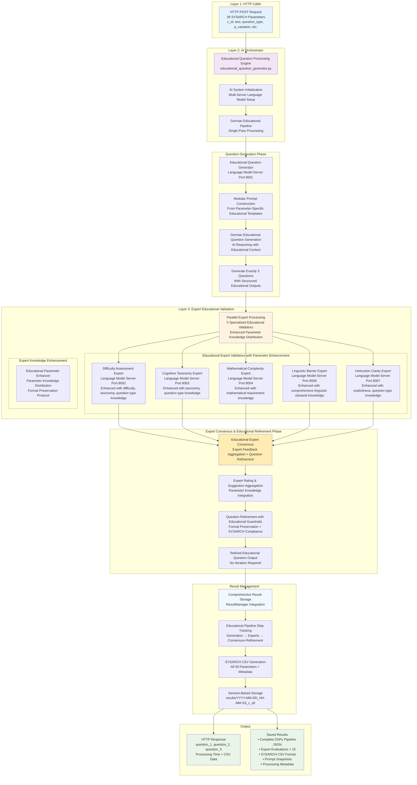

# Research Educational Question Generation System for 9th-Grade Economics using multi-layer small LM expert validation


educational question generation system designed for 9th-grade economics classes that produces pedagogically validated questions through expert consensus methodology. 

The system implements a three-layered educational architecture with single-pass processing: Request Handler → AI Orchestrator → Parallel Expert Validators.

The architecture utilizes advanced language model coordination to replace iterative validation cycles with intelligent single-pass expert consensus.

Implementation features include declarative processing modules with external prompt construction (prompt_builder.py), type safety through validation schemas (PYdantic), and comprehensive educational pipeline tracking (Result_Manager.py).

## Educational Processing Architecture



### Educational Expert Validators

| Educational Expert Module | AI Reasoning Signature | Language Model Port | Model | Target Parameters | Educational Expertise |
|---------------|----------------|-------------|-------|-------------------|-----------|
| **VariationExpertGerman** | `ValidateVariationGerman` | 8002 | mistral:7b | `p_variation` | Difficulty assessment (leicht/stammaufgabe/schwer) |
| **TaxonomyExpertGerman** | `ValidateTaxonomyGerman` | 8003 | qwen2.5:7b | `p_taxonomy_level` | Bloom's taxonomy (Stufe 1/2) |
| **MathExpertGerman** | `ValidateMathematicalGerman` | 8004 | llama3.2:3b | `p_mathematical_requirement_level` | Mathematical complexity (0-2) |
| **ObstacleExpertGerman** | `ValidateObstacleGerman` | 8006 | mistral:7b | `p_*_obstacle_*` | Linguistic barriers (passive, negation, complex NP) |
| **InstructionExpertGerman** | `ValidateInstructionGerman` | 8007 | llama3.1:8b | `p_instruction_*` | Instruction clarity and explicitness |

### Processing Implementation
- Single-pass processing: Caller → Orchestrator (prompt_builder → Generator → Experts in Parallel → Expert Consensus + Refinement)
- Expert consensus aggregates feedback and refines questions with parameter guardrails in single step
- VRAM utilization through context switching across multiple OLLAMA servers
- Declarative module structure with DSPy framework integration

### Type Safety Implementation
- Pydantic model validation for all input and output structures
- Structured JSON outputs with schema validation
- Type-safe processing pipeline eliminating runtime parsing errors
- Complete processing visibility through step-by-step tracking

### Maintainability Implementation  
- Declarative module architecture with functional separation
- Parameter-driven prompt construction from external .txt files (created in prompt_builder.py - parameter txt given to LMs they are concerned with, includes experts as well as dedicated generator aswell as the refiner)
- External prompt storage without hardcoded string literals

### Question Processing Implementation
- CSV output generation with initial and expert-refined question versions
- Comparative analysis capability between pre and post-expert validation
- Paired column structure for research analysis purposes

## Quick Start

### Prerequisites

- **Hardware**: AMD GPU with 20GB VRAM minimum
- **Operating System**: Manjaro Linux (Arch-based distribution) or compatible Linux distribution
- **Python**: Version 3.8 or higher
- **ROCm**: Version 6.2 or higher for GPU compute support
- Check requirements.txt

### Installation

1. **Clone and Setup**
   ```bash
   git clone <repository-url>
   cd educational-ai-system
   
   # Install ROCm and dependencies
   chmod +x setup_rocm_ManjArch_AMD7kSeries.sh
   ./setup_rocm_ManjArch_AMD7kSeries.sh
   sudo reboot  # Required for ROCm
   ```

2. **Verify and Optimize**
   ```bash
   # Check GPU detection
   rocm-smi
   
   # Optimize GPU for compute workloads
   ./optimize_gpu.sh
   
   # Download AI models
   ./download_models.sh
   ```

3. **Start OLAMA SERVER then the orchestrator System to be callable**
   ```bash
   # Start OLLAMA servers (ports 8001-8007)
   ./start_ollama_servers.sh
   
   # Start DSPy orchestrator (port 8000)
   python3 ALEE_Agent/educational_question_generator.py
   ```

4. **Verify Educational AI System Health**
   ```bash
   # Test educational AI endpoints
   curl http://localhost:8000/system-health
   curl http://localhost:8000/system-capabilities
   
   # Run systematic test
   python3 CallersWithTexts/stakeholder_test_system.py
   ```

## API Reference

### Primary Endpoint: Question Generation

```http
POST /generate-educational-questions
Content-Type: application/json

{
  "c_id": "181-1-3",
  "text": "Bedürfnisse sind Wünsche Menschen haben...",
  "question_type": "multiple-choice",
  "p_variation": "stammaufgabe",
  "p_taxonomy_level": "Stufe 1 (Wissen/Reproduktion)",
  "p_mathematical_requirement_level": "0",
  "p_root_text_reference_explanatory_text": "Nicht vorhanden",
  "p_root_text_obstacle_passive": "Nicht Enthalten",
  "p_root_text_obstacle_negation": "Nicht Enthalten",
  "p_root_text_obstacle_complex_np": "Nicht Enthalten",
  "p_root_text_contains_irrelevant_information": "Nicht Enthalten",
  "p_item_1_obstacle_passive": "Nicht Enthalten",
  "p_item_1_obstacle_negation": "Nicht Enthalten",
  "p_item_1_obstacle_complex_np": "Nicht Enthalten",
  "p_item_2_obstacle_passive": "Nicht Enthalten",
  "p_item_2_obstacle_negation": "Nicht Enthalten",
  "p_item_2_obstacle_complex_np": "Nicht Enthalten",
  "p_item_3_obstacle_passive": "Nicht Enthalten",
  "p_item_3_obstacle_negation": "Nicht Enthalten",
  "p_item_3_obstacle_complex_np": "Nicht Enthalten",
  "p_item_4_obstacle_passive": "Nicht Enthalten",
  "p_item_4_obstacle_negation": "Nicht Enthalten",
  "p_item_4_obstacle_complex_np": "Nicht Enthalten",
  "p_item_5_obstacle_passive": "Nicht Enthalten",
  "p_item_5_obstacle_negation": "Nicht Enthalten",
  "p_item_5_obstacle_complex_np": "Nicht Enthalten",
  "p_item_6_obstacle_passive": "Nicht Enthalten",
  "p_item_6_obstacle_negation": "Nicht Enthalten",
  "p_item_6_obstacle_complex_np": "Nicht Enthalten",
  "p_item_7_obstacle_passive": "Nicht Enthalten",
  "p_item_7_obstacle_negation": "Nicht Enthalten",
  "p_item_7_obstacle_complex_np": "Nicht Enthalten",
  "p_item_8_obstacle_passive": "Nicht Enthalten",
  "p_item_8_obstacle_negation": "Nicht Enthalten",
  "p_item_8_obstacle_complex_np": "Nicht Enthalten",
  "p_instruction_obstacle_passive": "Nicht Enthalten",
  "p_instruction_obstacle_negation": "Nicht Enthalten",
  "p_instruction_obstacle_complex_np": "Nicht Enthalten",
  "p_instruction_explicitness_of_instruction": "Implizit"
}
```

** Response:**
```json
{
  "question_1": "First generated question text...",
  "question_2": "Second generated question text...",
  "question_3": "Third generated question text...",
  "c_id": "181-1-3",
  "processing_time": 23.7,
  "csv_data": {
    "c_id": "181-1-3",
    "subject": "stammaufgabe",
    "type": "multiple-choice",
    "text": "1. Question1 2. Question2 3. Question3",
    "p.instruction_explicitness_of_instruction": "Implizit",
    "p.mathematical_requirement_level": "0 (Kein Bezug)",
    "p.taxanomy_level": "Stufe 1 (Wissen/Reproduktion)",
    "question_type": "multiple-choice",
    "p.variation": "stammaufgabe",
    "answers": "Extracted from questions with LM assistance",
    "dspy_consensus_used": true,
    "dspy_modular_prompts": true,
    "dspy_expert_count": 5,
    "dspy_all_approved": true
  },
  "generation_updates": [
    {
      "iteration": 1,
      "questions": ["Question 1 text", "Question 2 text", "Question 3 text"],
      "expert_consensus": [true, true, true],
      "dspy_metadata": {
        "modular_prompts_used": true,
        "single_pass_consensus": true,
        "all_approved": true
      }
    }
  ]
}
```

### System Endpoints

```http
GET /system-health          # Educational AI system health check
GET /system-capabilities    # Educational AI system configuration and module info
```

## Project Structure

```
/
├── .dev/                                   # Development & archived files
│   ├── _preDSPy/                          # Pre-DSPy system archive
│   │   ├── question_generator.py          # Original modular generator
│   │   ├── expert_handler.py              # Original expert handler
│   │   └── unused_prompts/                # Unused prompt files
│   └── providedProjectFromStakeHolder/    # Stakeholder validation data
│       └── explanation_metadata.csv       # Real educational texts (16 entries)
├── ALEE_Agent/                            # DSPy-enhanced educational system
│   ├── educational_question_generator.py  # DSPy-powered FastAPI orchestrator
│   ├── educational_modules.py             # German educational DSPy modules
│   ├── educational_signatures.py          # DSPy signatures for German education
│   ├── dspy_config.py                     # DSPy configuration with OLLAMA setup
│   ├── prompt_builder.py                  # Modular prompt construction with ExpertPromptEnhancer
│   ├── result_manager.py                  # Comprehensive result storage system
│   ├── results/                           # DSPy-managed result storage
│   │   └── YYYY-MM-DD_HH-MM-SS_c_id/     # Session folders with ISO timestamps
│   │       ├── prompts/                   # Snapshot of modular prompts
│   │       ├── results.csv                # Complete SYSARCH CSV format with question evolution
│   │       ├── session_metadata.json     # DSPy processing metadata
│   │       └── dspy_pipeline/             # Step-by-step DSPy processing
│   │           ├── 01_initial_generation_*.json     # Generation step
│   │           ├── 02_question_*_expert_*.json      # Expert validations (15 files)
│   │           ├── 03_question_*_consensus_*.json   # Consensus results (3 files)
│   │           └── 04_pipeline_timing_*.json        # Timing analysis
│   ├── dtoAndOutputPrompt/                # Core generation prompts
│   │   ├── questionGenerationInstruction.txt # DSPy generation instruction
│   │   ├── fallbackGenerationPrompt.txt  # Generation fallback prompt
│   │   └── outputFormatPrompt.txt         # Output format specification
│   ├── expertEval/                        # Expert validation system
│   │   ├── expertEvaluationInstruction.txt # Expert evaluation instruction
│   │   ├── questionImprovementInstruction.txt # Question improvement guidance
│   │   └── expertPrompts/                 # Expert-specific validation prompts
│   │       ├── variation_expert.txt       # Difficulty validation expert
│   │       ├── taxonomy_expert.txt        # Taxonomy validation expert
│   │       ├── math_expert.txt            # Mathematical complexity expert
│   │       ├── obstacle_expert.txt        # Linguistic obstacle expert
│   │       ├── instruction_expert.txt     # Instruction clarity expert
│   │       └── content_expert.txt         # Content relevance expert
│   └── mainGen/                          # Parameter-specific prompts
│       ├── variationPrompts/             # Difficulty & question type prompts
│       ├── taxonomyLevelPrompt/          # Bloom's taxonomy prompts
│       ├── mathematicalRequirementLevel/ # Mathematical complexity prompts
│       ├── rootTextParameterTextPrompts/ # Text obstacle prompts
│       ├── itemXObstacle/                # Item-specific obstacle prompts
│       ├── instructionObstacle/          # Instruction obstacle prompts
│       └── instructionExplicitnessOfInstruction/ # Instruction explicitness
├── CallersWithTexts/                      # Testing & validation system
│   ├── stakeholder_test_system.py         # Systematic 16-call test suite
│   ├── test_system.py                     # Basic DSPy system tests
│   └── interactive_question_generator.py  # Interactive parameter guidance
└── requirements.txt                       # DSPy & system dependencies
```

## Pipeline Tracking

The system saves comprehensive pipeline information for research and debugging:

### Pipeline Steps Saved

1. **Initial Generation** (`01_initial_generation_*.json`)
   - Generated questions and answers
   - Modular prompt used
   - Generation reasoning
   - Processing time

2. **Expert Evaluations** (`02_question_*_expert_*.json`)
   - Individual expert assessments (5 experts × 3 questions = 15 files)
   - Expert ratings, feedback, and suggestions
   - Processing time per expert
   - Expert context with parameter knowledge distribution

3. **Expert Consensus + Refinement** (`03_question_*_consensus_refinement_*.json`)
   - Aggregated expert feedback and refined questions
   - Format preservation verification results
   - Parameter compliance verification
   - Before/after refinement comparison
   - Consensus reasoning with guardrail enforcement

4. **Pipeline Timing** (`04_pipeline_timing_*.json`)
   - Complete timing breakdown for all phases
   - Performance analysis across generation, experts, and consensus-refinement
   - Resource utilization metrics

## Configuration

```python
# ALEE_Agent/dspy_config.py
OLLAMA_SERVERS = {
    "generation": "http://localhost:8001",  # Main generation
    "variation": "http://localhost:8002",   # Difficulty expert
    "taxonomy": "http://localhost:8003",    # Cognitive level expert
    "math": "http://localhost:8004",        # Mathematical expert
    "obstacle": "http://localhost:8006",    # Linguistic expert
    "instruction": "http://localhost:8007", # Instruction expert
}

DSPy_CONFIG = {
    "temperature": 0.1,
    "max_tokens": 2000,
    "timeout": 300,
    "retries": 3
}

# Expert Consensus uses default LM for aggregation and refinement
```

### Memory Management
```python
# Optimized for 20GB VRAM
MODEL_MEMORY_USAGE = {
    "llama3.1:8b": 5.5,     # Generation model
    "mistral:7b": 5.0,      # Expert models
    "qwen2.5:7b": 5.0,
    "llama3.2:3b": 2.5
}
MAX_CONCURRENT_EXPERTS = 2  # Memory-efficient processing
```

## Troubleshooting

### DSPy-Specific Issues

#### DSPy Module Not Loading
```bash
# Check DSPy installation
python3 -c "import dspy; print(dspy.__version__)"

# Verify OLLAMA connectivity
curl http://localhost:8001/api/tags
```

#### Pipeline Step Saving Errors
```bash
# Check results directory permissions
chmod 755 ALEE_Agent/results/

# Verify ResultManager functionality
python3 -c "from result_manager import ResultManager; rm = ResultManager(); print('OK')"
```

#### Expert Consensus Issues
```bash
# Test individual experts
curl -X POST http://localhost:8000/dspy-info

# Monitor expert processing
tail -f ALEE_Agent/server.log | grep "DSPy pipeline step"
```

### Performance Optimization

#### Slow DSPy Processing
- Verify GPU compute mode: `./optimize_gpu.sh`
- Check model quantization: Ensure Q4_K_M variants
- Monitor VRAM usage: `rocm-smi -d`
- Review expert server connectivity

#### Memory Issues
```bash
# Monitor DSPy pipeline memory
watch -n 1 'rocm-smi && echo "---" && curl -s http://localhost:8000/health-dspy'

# Reduce concurrent processing if needed
# Edit educational_modules.py: Use fewer parallel experts
```

## License

This project is licensed under the MIT License - see the [LICENSE](LICENSE) file for details.

## Usage Examples

### Systematic Testing (Production)

```bash
# Start DSPy system
./start_ollama_servers.sh
python3 ALEE_Agent/educational_question_generator.py &

# Run systematic stakeholder tests
# - 16 texts with systematic parameter coverage
# - Complete DSPy pipeline tracking
# - Comprehensive parameter coverage analysis
python3 CallersWithTexts/stakeholder_test_system.py

# Results saved to:
# results/2025-08-15_01-43-17_c_id/
# ├── results.csv              # SYSARCH CSV format
# ├── session_metadata.json    # Processing statistics
# ├── prompts/                 # Prompt snapshots (45 files)
# └── dspy_pipeline/           # Complete pipeline steps
#     ├── 01_initial_generation_*.json     # Generation
#     ├── 02_question_*_expert_*.json      # 15 expert evaluations
#     ├── 03_question_*_consensus_*.json   # 3 consensus results
#     └── 04_pipeline_timing_*.json        # Performance analysis
```

### Individual DSPy Request

```bash[README.md](README.md)
# Single DSPy request with comprehensive pipeline tracking
curl -X POST http://localhost:8000/generate-questions-dspy \
  -H "Content-Type: application/json" \
  -d '{
    "c_id": "181-sys-1",
    "text": "Bedürfnisse sind Wünsche Menschen haben...",
    "question_type": "multiple-choice",
    "p_variation": "stammaufgabe",
    "p_taxonomy_level": "Stufe 1 (Wissen/Reproduktion)",
    "p_mathematical_requirement_level": "0"
  }'

# Returns:
# - 3 validated questions
# - Complete DSPy processing metadata with expert prompt enhancement
# - SYSARCH-compliant CSV data
# - Pipeline steps automatically saved with parameter knowledge distribution tracking
```

## Acknowledgments

- **DSPy Team** - For the declarative self-improving Python framework
- **AMD ROCm Team** - For GPU compute platform support
- **Ollama Project** - For local LLM deployment infrastructure
- **FastAPI** - For asynchronous API framework
- **Educational Research Community** - For parameter frameworks and validation methodologies
- **Stakeholder Data Contributors (ALEE and Kateryna Lauterbach)** - For educational content provision

---