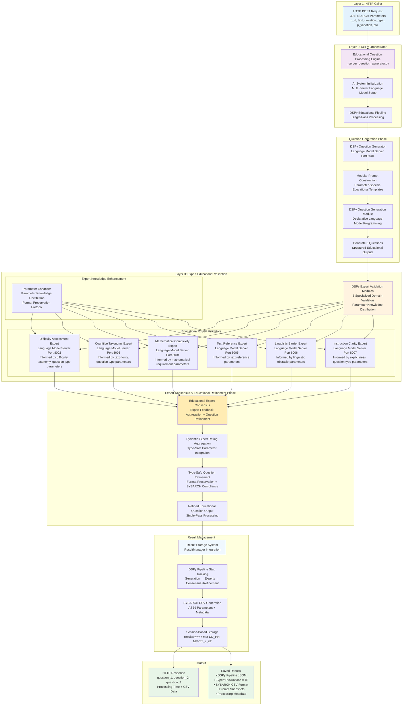

# Research Educational Question Generation System for 9th-Grade Economics using multi-layer small LM expert validation and DSPy Prompt Enhancement


educational question generation system designed for 9th-grade economics classes that produces pedagogically validated questions through expert consensus methodology and self-improves through DSPy refinement. 

The system implements a three-layered educational architecture with single-pass processing: Caller ->  | Orchestrator → Dedicated data backed generator -> Parallel Expert Validators -> Refinement Consensus | -> Callback and Result Save.

The architecture utilizes language model coordination to replace iterative validation cycles with refining single-pass expert consensus.

Implementation features include declarative processing modules with external prompt construction (prompt_builder.py), type safety through validation schemas (Pydantic [2]), and comprehensive educational pipeline tracking (Result_Manager.py).

---

All generated data as well as metadata about the pipeline and the experts as well as DSPy refinement steps is saved in ALEE_Agent/results/YYYY-MM-DD_HH-MM-SS_c_id/ with ISO timestamps for reproducibility and research purposes.
This project is part of ALEE Tübingens ongoing research into educational AI systems, and we therefore encourage adding your data to it on your branch and collaborating open-source.

---

## Processing Architecture



### Educational Expert Validators

| Educational Expert Module     | AI Reasoning Signature        | Language Model Port | Model       | Target Parameters                  | Educational Expertise                               |
|-------------------------------|-------------------------------|---------------------|-------------|------------------------------------|-----------------------------------------------------|
| **VariationExpertGerman**     | `ValidateVariationGerman`     | 8002                | mistral:7b  | `p_variation`                      | Difficulty assessment (leicht/stammaufgabe/schwer)  |
| **TaxonomyExpertGerman**      | `ValidateTaxonomyGerman`      | 8003                | qwen2.5:7b  | `p_taxonomy_level`                 | Bloom's taxonomy (Stufe 1/2)                        |
| **MathExpertGerman**          | `ValidateMathematicalGerman`  | 8004                | llama3.2:3b | `p_mathematical_requirement_level` | Mathematical complexity (0-2)                       |
| **TextReferenceExpertGerman** | `ValidateTextReferenceGerman` | 8005                | llama3.2:3b | `p_root_text_reference_*`          | Text reference validation                           |
| **ObstacleExpertGerman**      | `ValidateObstacleGerman`      | 8006                | mistral:7b  | `p_*_obstacle_*`                   | Linguistic barriers (passive, negation, complex NP) |
| **InstructionExpertGerman**   | `ValidateInstructionGerman`   | 8007                | llama3.1:8b | `p_instruction_*`                  | Instruction clarity and explicitness                |

### DSPy - Why and how?

The system employs DSPy (Declarative Self-improving Python) as its core orchestration framework, 
representing a paradigm shift from traditional prompt engineering to systematic language model programming. 

DSPy enables declarative specification of educational question generation through 
**Signatures** (input/output behavioral contracts), 
**Modules** (composable reasoning strategies like `dspy.ChainOfThought`), and 
**Optimizers** (automatic prompt and weight improvement algorithms). 

This architectural approach eliminates brittle prompt strings by externalizing all educational content to modular .txt files, 
enabling the `ModularPromptBuilder` to dynamically construct parameter-specific prompts from the 39 question parameters. 

DSPy's automatic optimization capabilities enable systematic few-shot example synthesis and instruction refinement, 
with research demonstrating that compiled pipelines outperform standard few-shot prompting and expert-created 
demonstrations across multiple language models [1]. 

In this implementation, the DSPy-orchestrated single-pass expert consensus architecture achieves 
question generation and validation in 0.05-70s, representing a so far varied speed gain, with questions needing **either** ~0.5s or ~60s
(which is too varied for a production system, check ALEE_AGENT/results) that needs further data-backing to test if a sustained self-improving system 
can achieve a high chance of high-quality educational question generation.

By decoupling educational logic from specific language model implementations, this project explorers if DSPy can enable
portable, maintainable question generation that can adapt across different model architectures while preserving the
educational parameter relationships required for 9th-grade economics instruction.

### Expert Validation and Suggestion Aggregated Refinement - Why and how?

The expert validation system implements a multi-agent architecture with five specialized domain validators 
(variation, taxonomy, mathematical, linguistic obstacle, and instruction clarity experts), 
each operating on dedicated language model servers (ports 8002-8007) with curated parameter knowledge bases. 

The `ExpertPromptEnhancer` class orchestrates parameter knowledge distribution, ensuring each expert receives contextually 
relevant information from the .txt prompt library while maintaining format preservation through validation guardrails. 

Expert feedback is captured through type-safe `ExpertSuggestion` Pydantic models [2], enabling systematic aggregation of ratings, 
feedback, and improvement suggestions across all validators. The `BatchQuestionRefiner` employs decision 
algorithms with configurable rating thresholds (default 3.0/5.0) and consensus requirements to determine refinement necessity, 
applying content and format improvements while preserving question type structural integrity through regex-based markup validation. 

This single-pass consensus architecture tries eliminating iterative loops through expert feedback aggregation and immediate refinement application, 
trying to maintain format compliance through Pydantic models [2] and fallback parsing, as well as ensuring all generated questions meet 
the specified educational parameters without degrading the carefully crafted `<option>`, `<true-false>`, and `<start-option>/<end-option>` 
markup structures required for downstream educational assessment systems.

### Ergo -> how can the system be further improved?

More and specific human-overseen data should be added to the modular prompt system to help the small LMs generate more 
accurate and contextually relevant educational questions. 

This data should furthermore help refine the prompts and the questions generated by the system, as well as the expert validation process.

This should, so the theory, allow for more accurate and contextually relevant question generation, as well as improved educational outcomes.

## Quick Start

### Prerequisites

- **Hardware**: AMD GPU with 20GB VRAM minimum
- **Operating System**: Manjaro Linux (Arch-based distribution) or compatible Linux distribution
- **Python**: Version 3.8 or higher
- **ROCm**: Version 6.2 or higher for GPU compute support
- Check requirements.txt

### Installation

1. **Clone and Setup**
   ```bash
   git clone <repository-url>
   cd educational-ai-system
   
   # Install ROCm and dependencies
   chmod +x setup_rocm_ManjArch_AMD7kSeries.sh
   ./setup_rocm_ManjArch_AMD7kSeries.sh
   sudo reboot  # Required for ROCm
   ```

2. **Verify and Optimize**
   ```bash
   # Check GPU detection
   rocm-smi
   
   # Optimize GPU for compute workloads
   ./optimize_gpu.sh
   
   # Download AI models
   ./download_models.sh
   ```

3. **Start OLAMA SERVER then the orchestrator System to be callable**
   ```bash
   # Start OLLAMA servers (ports 8001-8007)
   ./start_ollama_servers.sh
   
   # Start DSPy orchestrator (port 8000)
   python3 ALEE_Agent/_server_question_generator.py
   ```

4. **Verify Educational AI System Health**
   ```bash
   # Test educational AI endpoints
   curl http://localhost:8000/system-health
   curl http://localhost:8000/system-capabilities
   
   # Run systematic test
   python3 CallersWithTexts/stakeholder_test_system.py
   ```

## API Reference

### Primary Endpoint: Question Generation

```http
POST /generate-educational-questions
Content-Type: application/json

{
  "c_id": "181-1-3",
  "text": "Bedürfnisse sind Wünsche Menschen haben...",
  "question_type": "multiple-choice",
  "p_variation": "stammaufgabe",
  "p_taxonomy_level": "Stufe 1 (Wissen/Reproduktion)",
  "p_mathematical_requirement_level": "0",
  "p_root_text_reference_explanatory_text": "Nicht vorhanden",
  "p_root_text_obstacle_passive": "Nicht Enthalten",
  "p_root_text_obstacle_negation": "Nicht Enthalten",
  "p_root_text_obstacle_complex_np": "Nicht Enthalten",
  "p_root_text_contains_irrelevant_information": "Nicht Enthalten",
  "p_item_1_obstacle_passive": "Nicht Enthalten",
  "p_item_1_obstacle_negation": "Nicht Enthalten",
  "p_item_1_obstacle_complex_np": "Nicht Enthalten",
  "p_item_2_obstacle_passive": "Nicht Enthalten",
  "p_item_2_obstacle_negation": "Nicht Enthalten",
  "p_item_2_obstacle_complex_np": "Nicht Enthalten",
  "p_item_3_obstacle_passive": "Nicht Enthalten",
  "p_item_3_obstacle_negation": "Nicht Enthalten",
  "p_item_3_obstacle_complex_np": "Nicht Enthalten",
  "p_item_4_obstacle_passive": "Nicht Enthalten",
  "p_item_4_obstacle_negation": "Nicht Enthalten",
  "p_item_4_obstacle_complex_np": "Nicht Enthalten",
  "p_item_5_obstacle_passive": "Nicht Enthalten",
  "p_item_5_obstacle_negation": "Nicht Enthalten",
  "p_item_5_obstacle_complex_np": "Nicht Enthalten",
  "p_item_6_obstacle_passive": "Nicht Enthalten",
  "p_item_6_obstacle_negation": "Nicht Enthalten",
  "p_item_6_obstacle_complex_np": "Nicht Enthalten",
  "p_item_7_obstacle_passive": "Nicht Enthalten",
  "p_item_7_obstacle_negation": "Nicht Enthalten",
  "p_item_7_obstacle_complex_np": "Nicht Enthalten",
  "p_item_8_obstacle_passive": "Nicht Enthalten",
  "p_item_8_obstacle_negation": "Nicht Enthalten",
  "p_item_8_obstacle_complex_np": "Nicht Enthalten",
  "p_instruction_obstacle_passive": "Nicht Enthalten",
  "p_instruction_obstacle_negation": "Nicht Enthalten",
  "p_instruction_obstacle_complex_np": "Nicht Enthalten",
  "p_instruction_explicitness_of_instruction": "Implizit"
}
```

** Response:**
```json
{
  "question_1": "First generated question text...",
  "question_2": "Second generated question text...",
  "question_3": "Third generated question text...",
  "c_id": "181-1-3",
  "processing_time": 23.7,
  "csv_data": {
    "c_id": "181-1-3",
    "subject": "stammaufgabe",
    "type": "multiple-choice",
    "text": "1. Question1 2. Question2 3. Question3",
    "p.instruction_explicitness_of_instruction": "Implizit",
    "p.mathematical_requirement_level": "0 (Kein Bezug)",
    "p.taxanomy_level": "Stufe 1 (Wissen/Reproduktion)",
    "question_type": "multiple-choice",
    "p.variation": "stammaufgabe",
    "answers": "Extracted from questions with LM assistance",
    "dspy_consensus_used": true,
    "dspy_modular_prompts": true,
    "dspy_expert_count": 5,
    "dspy_all_approved": true
  },
  "generation_updates": [
    {
      "iteration": 1,
      "questions": ["Question 1 text", "Question 2 text", "Question 3 text"],
      "expert_consensus": [true, true, true],
      "dspy_metadata": {
        "modular_prompts_used": true,
        "single_pass_consensus": true,
        "all_approved": true
      }
    }
  ]
}
```

### System Endpoints

```http
GET /system-health          # Educational AI system health check
GET /system-capabilities    # Educational AI system configuration and module info
```

## Project Structure

```
/
├── .dev/                                   # Development & archived files
│   ├── _preDSPy/                          # Pre-DSPy system archive
│   │   ├── question_generator.py          # Original modular generator
│   │   ├── expert_handler.py              # Original expert handler
│   │   └── unused_prompts/                # Unused prompt files
│   └── providedProjectFromStakeHolder/    # Stakeholder validation data
│       └── explanation_metadata.csv       # Real educational texts (16 entries)
├── ALEE_Agent/                            # DSPy-enhanced educational system
│   ├── educational_question_generator.py  # DSPy-powered FastAPI orchestrator
│   ├── educational_modules.py             # German educational DSPy modules
│   ├── educational_signatures.py          # DSPy signatures for German education
│   ├── dspy_config.py                     # DSPy configuration with OLLAMA setup
│   ├── prompt_builder.py                  # Modular prompt construction with ExpertPromptEnhancer
│   ├── result_manager.py                  # Comprehensive result storage system
│   ├── results/                           # DSPy-managed result storage
│   │   └── YYYY-MM-DD_HH-MM-SS_c_id/     # Session folders with ISO timestamps
│   │       ├── prompts/                   # Snapshot of modular prompts
│   │       ├── results.csv                # Complete SYSARCH CSV format with question evolution
│   │       ├── session_metadata.json     # DSPy processing metadata
│   │       └── dspy_pipeline/             # Step-by-step DSPy processing
│   │           ├── 01_initial_generation_*.json     # Generation step
│   │           ├── 02_question_*_expert_*.json      # Expert validations (15 files)
│   │           ├── 03_question_*_consensus_*.json   # Consensus results (3 files)
│   │           └── 04_pipeline_timing_*.json        # Timing analysis
│   ├── dtoAndOutputPrompt/                # Core generation prompts
│   │   ├── questionGenerationInstruction.txt # DSPy generation instruction
│   │   ├── fallbackGenerationPrompt.txt  # Generation fallback prompt
│   │   └── outputFormatPrompt.txt         # Output format specification
│   ├── expertEval/                        # Expert validation system
│   │   ├── expertEvaluationInstruction.txt # Expert evaluation instruction
│   │   ├── questionImprovementInstruction.txt # Question improvement guidance
│   │   └── expertPrompts/                 # Expert-specific validation prompts
│   │       ├── variation_expert.txt       # Difficulty validation expert
│   │       ├── taxonomy_expert.txt        # Taxonomy validation expert
│   │       ├── math_expert.txt            # Mathematical complexity expert
│   │       ├── obstacle_expert.txt        # Linguistic obstacle expert
│   │       ├── instruction_expert.txt     # Instruction clarity expert
│   │       └── content_expert.txt         # Content relevance expert
│   └── mainGen/                          # Parameter-specific prompts
│       ├── variationPrompts/             # Difficulty & question type prompts
│       ├── taxonomyLevelPrompt/          # Bloom's taxonomy prompts
│       ├── mathematicalRequirementLevel/ # Mathematical complexity prompts
│       ├── rootTextParameterTextPrompts/ # Text obstacle prompts
│       ├── itemXObstacle/                # Item-specific obstacle prompts
│       ├── instructionObstacle/          # Instruction obstacle prompts
│       └── instructionExplicitnessOfInstruction/ # Instruction explicitness
├── CallersWithTexts/                      # Testing & validation system
│   ├── stakeholder_test_system.py         # Systematic 16-call test suite
│   ├── test_system.py                     # Basic DSPy system tests
│   └── interactive_question_generator.py  # Interactive parameter guidance
└── requirements.txt                       # DSPy & system dependencies
```

## Pipeline Tracking

The system saves pipeline information for research and debugging:

### Pipeline Steps Saved

1. **Initial Generation** (`01_initial_generation_*.json`)
   - Generated questions and answers
   - Modular prompt used
   - Generation reasoning
   - Processing time

2. **Expert Evaluations** (`02_question_*_expert_*.json`)
   - Individual expert assessments (5 experts × 3 questions = 15 files)
   - Expert ratings, feedback, and suggestions
   - Processing time per expert
   - Expert context with parameter knowledge distribution

3. **Expert Consensus + Refinement** (`03_question_*_consensus_refinement_*.json`)
   - Aggregated expert feedback and refined questions
   - Format preservation verification results
   - Parameter compliance verification
   - Before/after refinement comparison
   - Consensus reasoning with guardrail enforcement

4. **Pipeline Timing** (`04_pipeline_timing_*.json`)
   - Complete timing breakdown for all phases
   - Performance analysis across generation, experts, and consensus-refinement
   - Resource utilization metrics

## Configuration

```python
# ALEE_Agent/dspy_config.py
OLLAMA_SERVERS = {
    "generation": "http://localhost:8001",  # Main generation
    "variation": "http://localhost:8002",   # Difficulty expert
    "taxonomy": "http://localhost:8003",    # Cognitive level expert
    "math": "http://localhost:8004",        # Mathematical expert
    "obstacle": "http://localhost:8006",    # Linguistic expert
    "instruction": "http://localhost:8007", # Instruction expert
}

DSPy_CONFIG = {
    "temperature": 0.1,
    "max_tokens": 2000,
    "timeout": 300,
    "retries": 3
}

# Expert Consensus uses default LM for aggregation and refinement
```

### Memory Management
```python
# Optimized for 20GB VRAM
MODEL_MEMORY_USAGE = {
    "llama3.1:8b": 5.5,     # Generation model
    "mistral:7b": 5.0,      # Expert models
    "qwen2.5:7b": 5.0,
    "llama3.2:3b": 2.5
}
MAX_CONCURRENT_EXPERTS = 2  # Memory-efficient processing
```

## Troubleshooting

### DSPy-Specific Issues

#### DSPy Module Not Loading
```bash
# Check DSPy installation
python3 -c "import dspy; print(dspy.__version__)"

# Verify OLLAMA connectivity
curl http://localhost:8001/api/tags
```

#### Pipeline Step Saving Errors
```bash
# Check results directory permissions
chmod 755 ALEE_Agent/results/

# Verify ResultManager functionality
python3 -c "from result_manager import ResultManager; rm = ResultManager(); print('OK')"
```

#### Expert Consensus Issues
```bash
# Test individual experts
curl -X POST http://localhost:8000/dspy-info

# Monitor expert processing
tail -f ALEE_Agent/server.log | grep "DSPy pipeline step"
```

### Performance Optimization

#### Slow DSPy Processing
- Verify GPU compute mode: `./optimize_gpu.sh`
- Check model quantization: Ensure Q4_K_M variants
- Monitor VRAM usage: `rocm-smi -d`
- Review expert server connectivity

#### Memory Issues
```bash
# Monitor DSPy pipeline memory
watch -n 1 'rocm-smi && echo "---" && curl -s http://localhost:8000/health-dspy'

# Reduce concurrent processing if needed
# Edit modules.py: Use fewer parallel experts
```

## License

This project is licensed under the MIT License - see the [LICENSE](LICENSE) file for details.

## Usage Examples

### Systematic Testing (Production)

```bash
# Start DSPy system
./start_ollama_servers.sh
python3 ALEE_Agent/_server_question_generator.py &

# Run systematic stakeholder tests
# - 16 texts with systematic parameter coverage
# - Complete DSPy pipeline tracking
# - Comprehensive parameter coverage analysis
python3 CallersWithTexts/stakeholder_test_system.py

# Results saved to:
# results/2025-08-15_01-43-17_c_id/
# ├── results.csv              # SYSARCH CSV format
# ├── session_metadata.json    # Processing statistics
# ├── prompts/                 # Prompt snapshots (45 files)
# └── dspy_pipeline/           # Complete pipeline steps
#     ├── 01_initial_generation_*.json     # Generation
#     ├── 02_question_*_expert_*.json      # 15 expert evaluations
#     ├── 03_question_*_consensus_*.json   # 3 consensus results
#     └── 04_pipeline_timing_*.json        # Performance analysis
```

### Individual DSPy Request

```bash[README.md](README.md)
# Single DSPy request with comprehensive pipeline tracking
curl -X POST http://localhost:8000/generate-questions-dspy \
  -H "Content-Type: application/json" \
  -d '{
    "c_id": "181-sys-1",
    "text": "Bedürfnisse sind Wünsche Menschen haben...",
    "question_type": "multiple-choice",
    "p_variation": "stammaufgabe",
    "p_taxonomy_level": "Stufe 1 (Wissen/Reproduktion)",
    "p_mathematical_requirement_level": "0"
  }'

# Returns:
# - 3 validated questions
# - Complete DSPy processing metadata with expert prompt enhancement
# - SYSARCH-compliant CSV data
# - Pipeline steps automatically saved with parameter knowledge distribution tracking
```

## Acknowledgments

- **DSPy Team** - For the declarative self-improving Python framework
- **AMD ROCm Team** - For GPU compute platform support
- **Ollama Project** - For local LLM deployment infrastructure
- **FastAPI** - For asynchronous API framework
- **Educational Research Community** - For parameter frameworks and validation methodologies
- **Stakeholder Data Contributors (ALEE and Kateryna Lauterbach)** - For educational content provision

## References

[1] Khattab, O., Singhvi, A., Maheshwari, P., Zhang, Z., Santhanam, K., Vardhamanan, S., Haq, S., Sharma, A., Joshi, T. T., 
Moazam, H., Miller, H., Zaharia, M., & Potts, C. (2024). DSPy: Compiling Declarative Language Model Calls into State-of-the-Art 
Pipelines. In *The Twelfth International Conference on Learning Representations (ICLR 2024)*. 
[OpenReview](https://openreview.net/forum?id=sY5N0zY5Od) | [ArXiv](https://arxiv.org/abs/2310.03714)

[2] Colvin, S., Jolibois, E., Ramezani, H., Garcia Badaracco, A., Dorsey, T., Montague, D., Matveenko, S., Trylesinski, M., Runkle, S., Hewitt, D., Hall, A., & Plot, V. (2025). *Pydantic: Data validation using Python type hints* (Version 2.12.0) [Software]. [GitHub](https://github.com/pydantic/pydantic) | [Documentation](https://docs.pydantic.dev/latest/)

---